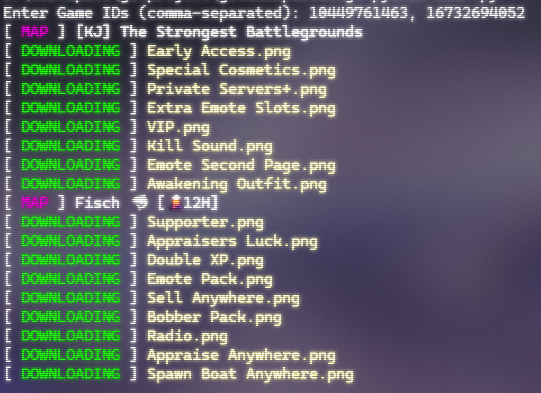

# Roblox GamePass Image Downloader 🎮📸

This Python script allows you to download the images of GamePasses for specified Roblox games using their Game ID. You can provide one or multiple Game IDs to fetch GamePass images for each game and save them locally. 🚀

---

## Features 🌟

- Fetches the title of the game using the game ID. 🏷️
- Downloads the GamePass images associated with the game. 📥
- Saves the images in a structured folder format based on the game title. 📂
- Supports multiple Game IDs input at once. 🧑‍💻
- Error handling for network and data retrieval issues. ⚠️

---

## Preview 📸



---

## Requirements 📦

Before running the script, make sure you have the following Python packages installed:

- `requests` (for making HTTP requests) 🌐
- `beautifulsoup4` (for parsing HTML content) 🔍
- `colorama` (for colored output in the terminal) 🌈

You can install these dependencies using pip:

```sh
pip install -r requirements.txt
```

---

## Run 🚀

```sh
python main.py
```

Or open ```run.bat``` file

---

### 💙 Made with love by ZEMONNUB